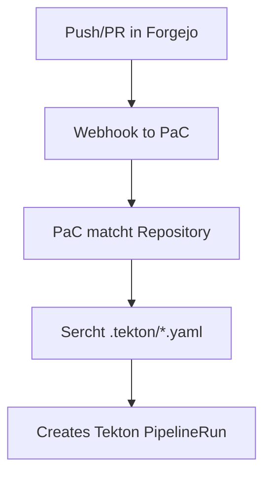
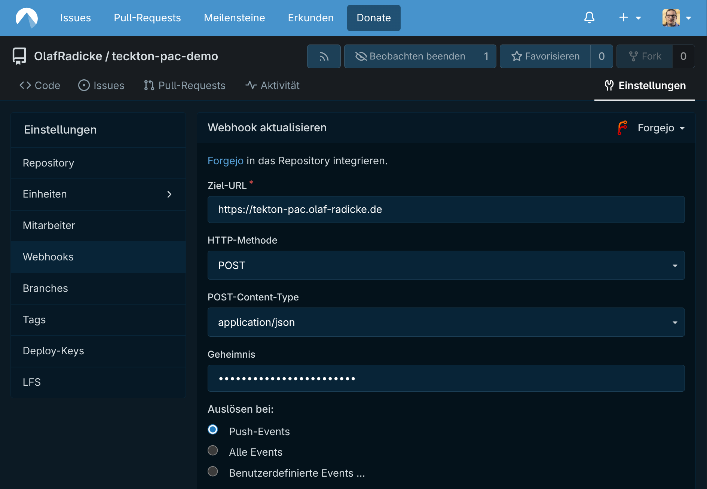
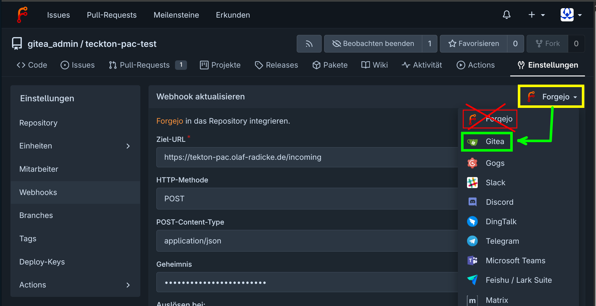

# PIPELINE AS CODE

- [PIPELINE AS CODE](#pipeline-as-code)
  - [BIG PICTURE](#big-picture)
  - [CONFIGURE THE REPOSITORY](#configure-the-repository)
  - [CREATE PIPELINE DEFINITION](#create-pipeline-definition)
  - [CONFIGURE THE WEBHOOK In FORGEJO](#configure-the-webhook-in-forgejo)
  - [DEBUGGING](#debugging)
    - [TEST REPOSITORY CR WITH](#test-repository-cr-with)
    - [PODS LOGS](#pods-logs)
    - [CONFIGURE LOGGING](#configure-logging)
    - [WEBHOOK](#webhook)
      - [Testing PaC‑Webhook‑Endpoints](#testing-pacwebhookendpoints)
    - [PIPELINES](#pipelines)
  - [KNOWN ISSUES](#known-issues)
    - [invalid JSON body for incoming webhook](#invalid-json-body-for-incoming-webhook)
    - [cannot find referenced task](#cannot-find-referenced-task)

## BIG PICTURE



For airgap system you can use [gosmee](https://github.com/chmouel/gosmee).

## CONFIGURE THE REPOSITORY

With your code.

```yaml
apiVersion: pipelinesascode.tekton.dev/v1alpha1
kind: Repository
metadata:
  name: forgejo-olaf-test-repo
  namespace: pipelines-as-code # same of PaC-Controller
spec:
  url: "http://localhost:8086/gitea_admin/teckton-pac-test" # your Forgejo-Repo-URL

  webhookSecret:
    name: pac-webhook-secret
    key: webhook-secret
```

Create secret:

```yaml
apiVersion: v1
kind: Secret
metadata:
  name: pac-webhook-token-secret
  namespace: pipelines-as-code
type: Opaque
stringData:
  webhook-secret: "XXXChangeMeXXX"
```

For the git clones:

```yaml
apiVersion: v1
kind: Secret
metadata:
  name: pac-git-token-secret
  namespace: pipelines-as-code
type: Opaque
stringData:
  token: "e5f9XXXXXXXXXX"
```

## CREATE PIPELINE DEFINITION

Create in your targe gir repo a directory with name .tekton/ and insert a file

with the pipeline code (for example):

```yaml
apiVersion: tekton.dev/v1beta1
kind: PipelineRun
metadata:
  name: pr-simple-run
  annotations:
    pipelinesascode.tekton.dev/on-event: "[pull_request, push]"
    pipelinesascode.tekton.dev/on-target-branch: "[main]"
spec:
  pipelineSpec:
    workspaces:
      - name: source
    tasks:
      - name: clone
        taskRef:
          kind: ClusterTask
          name: git-clone # aus tektoncd/catalog
        workspaces:
          - name: output
            workspace: source
        params:
          - name: url
            value: "$(params.repo_url)"
          - name: revision
            value: "$(params.revision)"
          - name: deleteExisting
            value: "true"

      - name: echo
        runAfter: [clone]
        taskSpec:
          workspaces:
            - name: source
          steps:
            - name: say-hello
              image: alpine:3.18
              workingDir: /workspace/source
              script: |
                echo "Hello from Tekton + Forgejo"
  params:
    - name: repo_url
      value: "$(params.repository_url)" # von PaC gesetzt
    - name: revision
      value: "$(params.revision)" # von PaC gesetzt
  workspaces:
    - name: source
      volumeClaimTemplate:
        spec:
          accessModes: ["ReadWriteOnce"]
          resources:
            requests:
              storage: 1Gi
```

## CONFIGURE THE WEBHOOK In FORGEJO



In the Forgejo repo:

`Settings` → `Webhooks` → `Add Webhook`

URL: your PaC-Endpoint, for example:

`https://tekton-pac.example.org`

or

`/hook-Endpoint`

Secret (German "Geheimnis"): exakt the same string of the webhook-secret.

Events: Push / Pull Request.

## DEBUGGING

### TEST REPOSITORY CR WITH

```bash
$ tkn-pac resolve \
  -f cicd/tekton/.tekton/PipelineRun-example-forgejo.yaml \
  -o /tmp/PipelineRun-example-forgejo.yaml \
  && kubectl create \
  -f /tmp/PipelineRun-example-forgejo.yaml \
  -n pipelines-as-code
```

### PODS LOGS

```bash
$ kubectl describe deploy pipelines-as-code-controller \
  -n pipelines-as-code
```

```bash
$ kubectl logs deploy/pipelines-as-code-controller \
  -n pipelines-as-code -f
```

### CONFIGURE LOGGING

```bash
$ kubectl get configmap pac-config-logging \
    -n pipelines-as-code \
    -o yaml
```

Patch log level:

```bash
$ kubectl patch configmap pac-config-logging -n pipelines-as-code --type json -p '[{"op": "replace", "path": "/data/loglevel.pac-watcher", "value":"debug"}]'

$ kubectl patch configmap pac-config-logging -n pipelines-as-code --type json -p '[{"op": "replace", "path": "/data/loglevel.pipelines-as-code-webhook", "value":"debug"}]'

$ kubectl patch configmap pac-config-logging -n pipelines-as-code --type json -p '[{"op": "replace", "path": "/data/loglevel.pipelinesascode", "value":"debug"}]'
```

See too: https://github.com/openshift-pipelines/pipelines-as-code/blob/main/docs/content/docs/install/logging.md

### WEBHOOK

Check the logs:

```bash
$ kubectl logs -n pipelines-as-code deploy/pipelines-as
-code-controller -f
```

#### Testing PaC‑Webhook‑Endpoints

```bash
$ MY_NS=debugging-tools
$ HOOK_ADDR='https://pipelines-as-code-webhook.pipelines-as-code.svc:443'
$ HOOK_ADDR='http://pipelines-as-code-controller.pipelines-as-code.svc:8080/incoming'
$ SIG=xxxx
```

Einfacher Test:

```bash
$ kubectl exec -it \
  $(
    kubectl get pod \
      -l app=debugger \
      -o jsonpath='{.items[0].metadata.name}' \
      -n ${MY_NS}) \
   -n ${MY_NS} \
  -- curl -v -I ${HOOK_ADDR}
```

```bash
$ kubectl exec -it \
  $(
    kubectl get pod \
      -l app=debugger \
      -o jsonpath='{.items[0].metadata.name}' \
      -n ${MY_NS}) \
   -n ${MY_NS} \
  -- curl \
    -vk \
    -X POST \
    -H "Content-Type: application/json" \
    -H "X-Gitea-Event: push" \
    -H "X-Gitea-Signature: ${SIG}" \
    -d '{"ref":"refs/heads/main",
    "repository": {"clone_url": "https://forgejo-http.forgejo:3000/gitea_admin/teckton-pac-test.git"}}' \
    ${HOOK_ADDR}
```

```bash
$ kubectl exec -it \
  $(
    kubectl get pod \
      -l app=debugger \
      -o jsonpath='{.items[0].metadata.name}' \
      -n ${MY_NS}) \
   -n ${MY_NS} \
  -- curl \
    -H "Content-Type: application/json" \
    -k \
    -X POST \
    "${HOOK_ADDR}/" \
    -d '{"repository":"repo","branch":"main","pipelinerun":"target-pipelinerun","secret":"pac-webhook-secret", "clone_url": "https://forgejo-http.forgejo:3000/gitea_admin/teckton-pac-test.git"}'
```

### PIPELINES

```bash
kubectl get pipelineruns -A
```

```bash
$ kubectl describe pipelinerun example-forgejo-s89gk -n pipelines-as-code
```

## KNOWN ISSUES

### invalid JSON body for incoming webhook

If you add a new web hook in the webinterface of forgejo and you get this error in the log:

```bash
{"level":"info","ts":"2026-01-02T16:33:16.531Z","logger":"pipelinesascode","caller":"adapter/incoming.go:120","msg":"incoming request has been requested: /incoming","commit":"bb4933c"}
{"level":"error","ts":"2026-01-02T16:33:16.531Z","logger":"pipelinesascode","caller":"adapter/adapter.go:178","msg":"error processing incoming webhook: invalid JSON body for incoming webhook: json: cannot unmarshal object into Go struct field incomingPayload.repository of type string","commit":"bb4933c","stacktrace":"github.com/openshift-pipelines/pipelines-as-code/pkg/adapter.(*listener).Start.listener.handleEvent.func2\n\tgithub.com/openshift-pipelines/pipelines-as-code/pkg/adapter/adapter.go:178\nnet/http.HandlerFunc.ServeHTTP\n\tnet/http/server.go:2294\nnet/http.(*ServeMux).ServeHTTP\n\tnet/http/server.go:2822\nnet/http.(*timeoutHandler).ServeHTTP.func1\n\tnet/http/server.go:3827"}
```

Than you choice the wrong repo typ in the hook.



### cannot find referenced task

Logs:

```bash
{"level":"error","ts":"2026-01-07T13:57:38.720Z","logger":"pipelinesascode","caller":"events/emit.go:49","msg":"an error occurred: cannot find referenced task git-clone. if it's a remote task make sure to add it in the annotations","commit":"bb4933c","provider":"gitea","event-id":"b965f393-8e91-4fa3-a5fd-08c632e4cd0c","event-sha":"951918d3d62686bb35a99a09867e9b01933b9876","event-type":"push","source-repo-url":"http://forgejo-http.forgejo:3000/gitea_admin/teckton-pac-test","target-branch":"refs/heads/main","namespace":"pipelines-as-code","stacktrace":"github.com/openshift-pipelines/pipelines-as-code/pkg/events.(*EventEmitter).EmitMessage\n\tgithub.com/openshift-pipelines/pipelines-as-code/pkg/events/emit.go:49\ngithub.com/openshift-pipelines/pipelines-as-code/pkg/pipelineascode.(*PacRun).Run\n\tgithub.com/openshift-pipelines/pipelines-as-code/pkg/pipelineascode/pipelineascode.go:81\ngithub.com/openshift-pipelines/pipelines-as-code/pkg/adapter.(*sinker).processEvent\n\tgithub.com/openshift-pipelines/pipelines-as-code/pkg/adapter/sinker.go:75\ngithub.com/openshift-pipelines/pipelines-as-code/pkg/adapter.(*listener).Start.listener.handleEvent.func2.1\n\tgithub.com/openshift-pipelines/pipelines-as-code/pkg/adapter/adapter.go:210"}
```

And is your file name lik this:

`.tekton/PipelineRun-example-forgejo.yaml` than it is an kown issue. It is not documented but PaC ignores files with **uppercase letters** in the filename.
